# 🦀 Claude Coding Mascot

A **coding-status mascot for your GitHub profile README**. Claude sits at a laptop
and types (headband on, confetti when he's on a roll) when you're coding, and
naps when you're idle — fully themeable via URL params, served from Vercel.




> **Live now:** hosted endpoint + a config **playground** + a **VS Code extension**
> that flips the mascot to *coding* / *idle* automatically while you work. Preview
> any look with `?status=`, or wire it live with the extension + a `?id=` embed
> (see [Go live](#go-live-vs-code)).

It's all one animated **SVG** with **SMIL** animation — no JavaScript — so it
plays inside a GitHub README ``.

---

## Customize it

Everything is a URL query param on the SVG endpoint. Try the **playground** (the
site root once deployed, or `vercel dev` locally) to configure it visually and
copy the snippet. Or build the URL by hand:

**Live:** playground → <https://pet.simiyonvinscentsamuel.tech> · endpoint → `/mascot.svg`

```md

```

| Param | Type | Default | Notes |
|---|---|---|---|
| `status` | `coding` \| `idle` | `idle` | which scene to show (Phase 2: live) |
| `theme` | `light` \| `dark` \| `terminal` \| `candy` | `light` | preset; individual colors below override it |
| `body` | hex (no `#`) | theme | Claude body color |
| `accent` | hex | theme | headband / dot / glow / border |
| `text` | hex | theme | title + text color |
| `bg` | hex or `transparent` | theme | card background |
| `font` | `system` \| `mono` \| `inter` \| `serif` | `system` | font family |
| `label` | text | `Claude` | name shown ("X is coding") |
| `hide_time` | bool | `false` | hide the elapsed `· 23m` |
| `border` | bool | `true` | card border on/off |
| `radius` | int 0–40 | `26` | card corner radius |
| `mins` | int | `23` | demo elapsed minutes (Phase 1 only) |

Invalid values fall back to the default; text is sanitized; colors are validated
hex. Bare hex (no `#`) keeps URLs clean — e.g. `body=10A37F`.

---

## Run locally

```bash
npm install
npm run preview     # writes assets/preview-*.svg — open one to eyeball the animation
npm run dev         # vercel dev — playground at http://localhost:3000, SVG at /mascot.svg
```

Open `http://localhost:3000/mascot.svg?status=coding&theme=terminal` to see params live.

---

## Deploy (Vercel)

```bash
npm i -g vercel       # if you don't have it
vercel login
npm run deploy        # -> https://pet.simiyonvinscentsamuel.tech
```

Then embed:

```md

```

GitHub serves README images through its camo proxy with ~minutes freshness, so
the *status* is current as of the last profile view; the *animation* always plays.

---

## Go live (VS Code)

Make the mascot follow your *actual* coding — it flips to **coding** while you
type and **idle** when you stop.

1. Open the [`extension/`](extension) folder in VS Code and press **F5** (launches a
   dev host), or package it: `cd extension && npx @vscode/vsce package` → *Install from VSIX…*.
2. Run **Claude Mascot: Generate Key & Link** (or click the status-bar item). It
   generates a secret key (kept in your IDE) and copies it to the clipboard.
3. On the [link page](https://pet.simiyonvinscentsamuel.tech/link.html), paste the key →
   copy the `?id=…` README snippet into your GitHub profile.
4. Code. The extension heartbeats `coding`; after ~5 idle minutes it goes `idle`.

The README embed uses a **public id** = `sha256(key)`, so your secret key never
appears publicly and nobody can spoof your status. Paste the same key into other
editors to drive the one mascot from all of them.

```md

```

How it stays live: the extension POSTs to `/api/coding-now` (Bearer key); state is
stored in **Upstash Redis** with a 5-minute TTL; `/mascot.svg?id=…` reads it.

---

## Roadmap

**3D upgrade:** swap the SVG for pre-rendered Spline/Blender frames (APNG) via the
`assets/frames/` pipeline (`npm run build:frames`).

---

## Project layout

| Path | What |
|---|---|
| `src/mascot.js` | the mascot renderer — themeable, state-aware SVG (pure) |
| `src/store.js` | Upstash Redis helpers + `sha256(key)` → public id |
| `api/mascot.js` | SVG endpoint — live status by `?id=`, else `?status=` demo |
| `api/coding-now.js` · `api/coding-stopped.js` | IDE pings (Bearer key) |
| `api/link.js` | key → public id |
| `public/` | playground (`index.html`) + IDE link page (`link.html`) |
| `extension/` | the VS Code extension (key gen + activity → live signal) |
| `vercel.json` | routes `/mascot.svg` → `/api/mascot` |
| `scripts/preview.mjs` | emit static preview SVGs |

*(The Cloudflare Worker files `src/worker.js` / `wrangler.toml` are superseded by
the Vercel functions and kept only for reference.)*

## Mascot & credits

The mascot is the Claude Claude, ported from
[`clawd-react`](https://github.com/stevysmith/clawd-react) (MIT — see
[`THIRD_PARTY_NOTICES.md`](THIRD_PARTY_NOTICES.md)). The headband + jump/confetti
beat nods to the [Codrops Claude-mascot breakdown](https://tympanus.net/codrops/2026/05/05/reverse-engineering-claude-ais-mascot-animations-with-svg-and-gsap/).
Claude-only by design.
